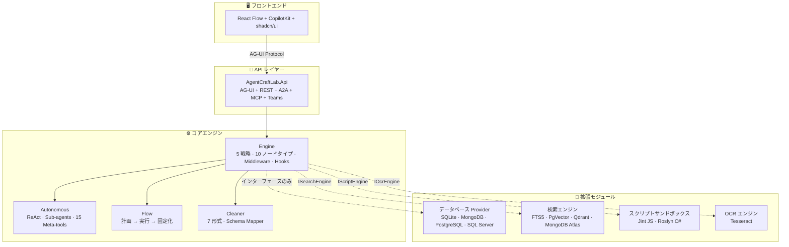

# AgentCraftLab

[English](README.md) | [繁體中文](README.zh-TW.md) | [日本語](README.ja.md)

[](https://timothysu2015.github.io/agent-craft-lab/)
[](LICENSE)
[](https://dotnet.microsoft.com/)

.NET で構築されたオープンソース AI Agent プラットフォーム — .NET エコシステムから離れることなく、エージェントワークフローを設計・テスト・デプロイできます。


## なぜ AgentCraftLab なのか？

チームが .NET を使用していて AI Agent 機能を求めている場合、選択肢は限られています。ほとんどのエージェントプラットフォームは Python、Node.js、または Docker 重視のスタックを必要とします。AgentCraftLab は**ネイティブ .NET** で、**外部依存関係ゼロの SQLite** で動作し、.NET が動作するどこにでもデプロイできます。

| | AgentCraftLab | Flowise | Dify | n8n |
|---|:---:|:---:|:---:|:---:|
| .NET native | O | X | X | X |
| No Docker required | O | X | X | X |
| Visual workflow editor | O | O | O | O |
| MCP + A2A protocols | O | Partial | Partial | X |
| Teams Bot built-in | O | X | X | X |
| Local-first (SQLite) | O | X | X | X |
| Open source | O | O | Partial | O |

## 機能

**ビジュアルワークフロースタジオ** — React Flow によるドラッグ＆ドロップエディタ。10 種類以上のノードタイプ：Agent、Condition、Loop、Parallel、Iteration、Human-in-the-Loop、HTTP Request、Code Transform、A2A Agent、Autonomous Agent。

**20 以上の組み込みツール** — Web 検索、メール、ファイル操作、データベースクエリ、コード探索など。MCP サーバー、A2A エージェント、またはカスタム HTTP API で拡張可能。

**AI ビルドモード** — 自然言語で必要なものを記述するだけで、AI がワークフローを自動生成します。

**マルチプロトコルデプロイ** — ワークフローを A2A エンドポイント、MCP サーバー、REST API、または Teams Bot として公開 — すべて同一プラットフォームから。

**自律エージェント** — AI に目標を与え、残りは AI に任せます。サブエージェント連携、ツール呼び出し、リスク承認、クロスセッションメモリを備えた ReAct ループ。

**Flow モード** — AI が構造化されたノードシーケンスを計画し、実行した後、結果を再利用可能なワークフローとして結晶化します。探索と本番環境の架け橋です。

**組み込み検索エンジン（CraftSearch）** — 全文検索 + ベクトル + RRF ハイブリッドランキング。5 つのプロバイダ：SQLite FTS5、PgVector、Qdrant、MongoDB Atlas、InMemory。ナレッジベースごとの検索エンジンルーティング — 異なるナレッジベースで異なる検索バックエンドを使用可能。PDF、DOCX、PPTX、HTML の抽出をサポート。

**RAG パイプライン** — ドキュメントをアップロードし、自動的に抽出・分割・埋め込み・検索。一時アップロードまたは永続的なナレッジベースに対応。

**Doc Refinery** — ドキュメントをアップロードし、LLM + Schema Mapper で構造化データをクリーニング・抽出。デュアルモード：高速（単一 LLM）または精密（マルチレイヤーエージェント + LLM Challenge 検証）。

**ミドルウェアパイプライン** — GuardRails、PII マスキング、レート制限、リトライ、ロギング — すべてコンポーザブルな `DelegatingChatClient` デコレータとして実装。

## クイックスタート

### 前提条件

- [.NET 10 SDK](https://dotnet.microsoft.com/download/dotnet/10.0)
- [Node.js 20+](https://nodejs.org/)
- LLM API キー（Azure OpenAI、OpenAI、または互換プロバイダ）

### 1. クローンとインストール

```bash
git clone https://github.com/TimothySu2015/agent-craft-lab.git
cd agent-craft-lab/AgentCraftLab.Web
npm install
```

### 2. すべてのサービスを起動

```bash
npm run dev:all
```

3 つのサービスが同時に起動します：
- **.NET API** — `http://localhost:5200`（AG-UI + REST エンドポイント）
- **CopilotKit Runtime** — `http://localhost:4000`
- **React Dev Server** — `http://localhost:5173`

ブラウザで `http://localhost:5173` を開いてください。

### 3. LLM 認証情報の設定

サイドバーの **Credentials** に移動し、LLM プロバイダ（Azure OpenAI、OpenAI、Anthropic、Ollama など）を追加してください。

### 4. 最初のワークフローを作成

1. サイドバーから **Studio** を開く
2. **Agent** ノードをキャンバスにドラッグ
3. システムプロンプトを設定し、ツールを割り当てる
4. **Execute** タブに切り替えてメッセージを入力

または **AI Build** を使用 — チャットパネルに説明を入力すると、AI がワークフローを自動生成します。

## アーキテクチャ



### プロジェクト構成

```
AgentCraftLab.sln
├── AgentCraftLab.Api/                              ← .NET API (AG-UI + REST, Minimal API)
├── AgentCraftLab.Web/                              ← React frontend (React Flow + CopilotKit + shadcn/ui)
├── AgentCraftLab.Engine/                           ← Core execution engine (no DB dependency)
├── AgentCraftLab.Autonomous/                       ← ReAct agent (sub-agents, tools, safety)
├── AgentCraftLab.Autonomous.Flow/                  ← Flow mode (plan -> execute -> crystallize)
├── AgentCraftLab.Cleaner/                          ← Data cleaning engine (7 formats + Schema Mapper)
├── extensions/
│   ├── data/
│   │   ├── AgentCraftLab.Data/                     ← Data layer abstractions (15 Store interfaces)
│   │   ├── AgentCraftLab.Data.Sqlite/              ← SQLite provider (default, zero-config)
│   │   ├── AgentCraftLab.Data.MongoDB/             ← MongoDB provider (optional)
│   │   ├── AgentCraftLab.Data.PostgreSQL/          ← PostgreSQL provider (optional)
│   │   └── AgentCraftLab.Data.SqlServer/           ← SQL Server provider (optional)
│   ├── search/AgentCraftLab.Search/                ← Search engine (FTS5 + PgVector + Qdrant + RRF)
│   ├── script/AgentCraftLab.Script/                ← Script sandbox (Jint JS + Roslyn C#)
│   └── ocr/AgentCraftLab.Ocr/                      ← OCR engine (Tesseract)
└── AgentCraftLab.Tests/                            ← Unit tests (1316)
```

### Engine — ライブラリとして使用

AgentCraftLab.Engine は Web UI なしで単独で使用できます：

```csharp
builder.Services.AddAgentCraftEngine();
builder.Services.AddSqliteDataProvider("Data/agentcraftlab.db");

// ...

var engine = serviceProvider.GetRequiredService<WorkflowExecutionService>();
await foreach (var evt in engine.ExecuteAsync(request))
{
    Console.WriteLine($"[{evt.Type}] {evt.Text}");
}
```

### ワークフロー実行戦略

エンジンは適切な実行戦略を自動検出して選択します：

| 戦略 | 使用条件 |
|----------|------|
| **Single Agent** | エージェント 1 つ、分岐なし |
| **Sequential** | 複数エージェントのチェーン |
| **Concurrent** | すべてのエージェントを同時実行 |
| **Handoff** | ルーターエージェントが専門エージェントに委任 |
| **Imperative** | 条件、ループ、並列分岐を含むグラフ走査 |

### ノードタイプ

| ノード | 説明 | LLM コスト |
|------|-------------|----------|
| `agent` | ツール付き LLM エージェント | あり |
| `code` | 確定的変換（テンプレート、正規表現、json-path など） | ゼロ |
| `condition` | コンテンツに基づく分岐（contains/regex） | ゼロ |
| `iteration` | リストに対する foreach ループ | アイテムごと |
| `parallel` | ファンアウト/ファンイン並行実行 | ブランチごと |
| `loop` | 条件が満たされるまで繰り返し | イテレーションごと |
| `human` | ユーザー入力/承認の待機 | ゼロ |
| `http-request` | 直接 HTTP API 呼び出し | ゼロ |
| `a2a-agent` | リモート A2A エージェントの呼び出し | ゼロ（リモート） |
| `autonomous` | サブエージェント付き ReAct ループ | あり |

### デプロイプロトコル

任意のワークフローを以下として公開：

| プロトコル | エンドポイント | ユースケース |
|----------|----------|----------|
| **A2A** | `POST /a2a/{key}` | Agent 間通信 |
| **MCP** | `POST /mcp/{key}` | Claude、ChatGPT ツール統合 |
| **REST API** | `POST /api/{key}` | 任意の HTTP クライアント |
| **Teams Bot** | `POST /teams/{key}/api/messages` | Microsoft Teams |

すべてのエンドポイントは API キー認証で保護されています。

## データベース

AgentCraftLab はデフォルトで **SQLite** を使用 — 設定不要、外部データベース不要。設定を 1 つ変更するだけでエンタープライズデータベースに切り替え可能：

| プロバイダ | 設定値 | ユースケース |
|----------|-------------|----------|
| **SQLite** | `sqlite`（デフォルト） | ローカル開発、シングルユーザー |
| **MongoDB** | `mongodb` | ドキュメント DB、クラウドネイティブ |
| **PostgreSQL** | `postgresql` | エンタープライズリレーショナル DB |
| **SQL Server** | `sqlserver` | .NET エンタープライズ、Azure SQL |

```json
{
  "Database": {
    "Provider": "postgresql",
    "ConnectionString": "Host=localhost;Database=agentcraftlab;..."
  }
}
```

各ナレッジベースは異なる検索バックエンド（SQLite FTS5、PgVector、Qdrant、または MongoDB Atlas）を使用可能 — Data Source バインディングによりナレッジベースごとに設定できます。

## 使用技術

- [.NET 10](https://dotnet.microsoft.com/) — API バックエンド + 実行エンジン
- [React](https://react.dev/) + [React Flow](https://reactflow.dev/) — ビジュアルワークフローエディタ
- [CopilotKit](https://www.copilotkit.ai/) — AG-UI プロトコル + チャットインターフェース
- [Microsoft.Agents.AI](https://github.com/microsoft/agent-framework) (1.0 GA) — エージェントオーケストレーションフレームワーク
- [SQLite](https://sqlite.org/) / [PostgreSQL](https://www.postgresql.org/) / [MongoDB](https://www.mongodb.com/) / [SQL Server](https://www.microsoft.com/sql-server) — プラガブルデータベースプロバイダ

## コントリビューション

コントリビューションを歓迎します！変更したい内容について、まず Issue を作成してください。

## ライセンス

Copyright 2026 AgentCraftLab

Apache License, Version 2.0 に基づいてライセンスされています。詳細は [LICENSE](LICENSE) をご覧ください。
