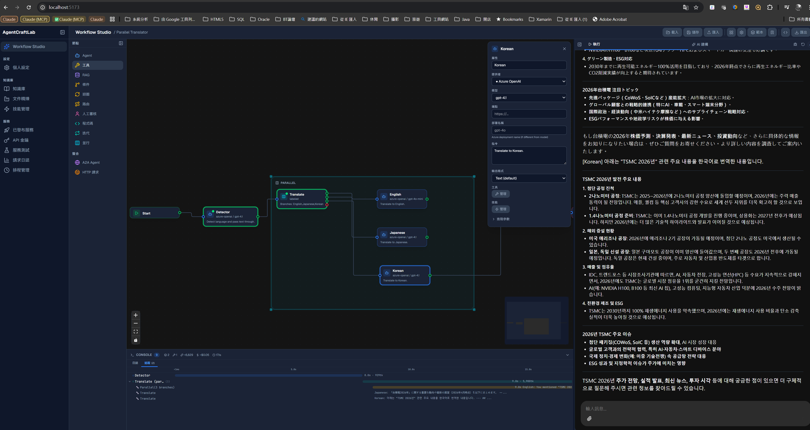
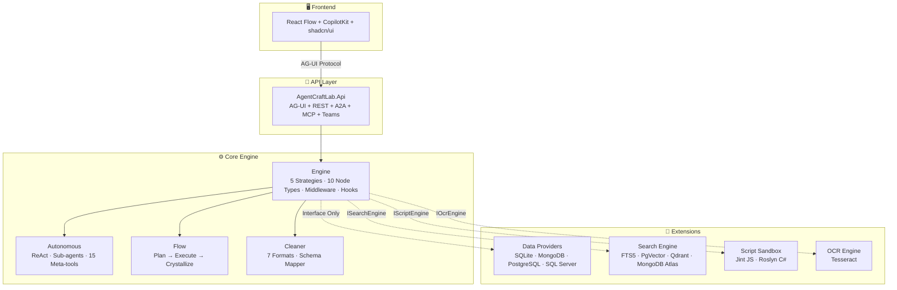

# AgentCraftLab

[English](README.md) | [繁體中文](README.zh-TW.md) | [日本語](README.ja.md)

[](https://timothysu2015.github.io/agent-craft-lab/)
[](LICENSE)
[](https://dotnet.microsoft.com/)

The open-source AI Agent platform built on .NET — design, test, and deploy agent workflows without leaving the .NET ecosystem.



## Why AgentCraftLab?

If your team runs on .NET and you want AI Agent capabilities — your options are limited. Most agent platforms require Python, Node.js, or Docker-heavy stacks. AgentCraftLab is **native .NET**, runs on **SQLite with zero external dependencies**, and deploys anywhere .NET runs.

| | AgentCraftLab | Flowise | Dify | n8n |
|---|:---:|:---:|:---:|:---:|
| .NET native | O | X | X | X |
| No Docker required | O | X | X | X |
| Visual workflow editor | O | O | O | O |
| MCP + A2A protocols | O | Partial | Partial | X |
| Teams Bot built-in | O | X | X | X |
| Local-first (SQLite) | O | X | X | X |
| Open source | O | O | Partial | O |

## Features

**Visual Workflow Studio** — React Flow drag-and-drop editor with 10+ node types: Agent, Condition, Loop, Parallel, Iteration, Human-in-the-Loop, HTTP Request, Code Transform, A2A Agent, and Autonomous Agent.

**20+ Built-in Tools** — Web search, email, file operations, database queries, code exploration, and more. Extend with MCP servers, A2A agents, or custom HTTP APIs.

**AI Build Mode** — Describe what you want in natural language, and AI generates the workflow for you.

**Multi-Protocol Deployment** — Publish workflows as A2A endpoints, MCP servers, REST APIs, or Teams Bots — all from the same platform.

**Autonomous Agent** — Give AI a goal and let it figure out the rest. ReAct loop with sub-agent collaboration, tool calling, risk approval, and cross-session memory.

**Flow Mode** — AI plans a structured node sequence, executes it, then crystallizes the result into a reusable workflow. The bridge between exploration and production.

**Built-in Search Engine (CraftSearch)** — Full-text + vector + RRF hybrid ranking. 5 providers: SQLite FTS5, PgVector, Qdrant, MongoDB Atlas, InMemory. Per-KB search engine routing — different knowledge bases can use different search backends. Supports PDF, DOCX, PPTX, HTML extraction.

**RAG Pipeline** — Upload documents, auto-extract and chunk, embed, and search. Works with temporary uploads or persistent knowledge bases.

**Doc Refinery** — Upload documents, clean and extract structured data with LLM + Schema Mapper. Dual-mode: fast (single LLM) or precise (multi-layer agent + LLM Challenge verification).

**Middleware Pipeline** — GuardRails, PII masking, rate limiting, retry, logging — all as composable `DelegatingChatClient` decorators.

## Quick Start

### Prerequisites

- [.NET 10 SDK](https://dotnet.microsoft.com/download/dotnet/10.0)
- [Node.js 20+](https://nodejs.org/)
- An LLM API key (Azure OpenAI, OpenAI, or compatible providers)

### 1. Clone and Install

```bash
git clone https://github.com/TimothySu2015/agent-craft-lab.git
cd agent-craft-lab/AgentCraftLab.Web
npm install
```

### 2. Start All Services

```bash
npm run dev:all
```

This launches three services concurrently:
- **.NET API** — `http://localhost:5200` (AG-UI + REST endpoints)
- **CopilotKit Runtime** — `http://localhost:4000`
- **React Dev Server** — `http://localhost:5173`

Open `http://localhost:5173` in your browser.

### 3. Configure LLM Credentials

Navigate to **Credentials** in the sidebar and add your LLM provider (Azure OpenAI, OpenAI, Anthropic, Ollama, etc.).

### 4. Create Your First Workflow

1. Open **Studio** from the sidebar
2. Drag an **Agent** node onto the canvas
3. Set a system prompt and assign tools
4. Switch to the **Execute** tab and enter your message

Or use **AI Build** — type a description in the chat panel and let AI generate the workflow for you.

## Architecture



### Project Structure

```
AgentCraftLab.sln
├── AgentCraftLab.Api/                              ← .NET API (AG-UI + REST, Minimal API)
├── AgentCraftLab.Web/                              ← React frontend (React Flow + CopilotKit + shadcn/ui)
├── AgentCraftLab.Engine/                           ← Core execution engine (no DB dependency)
├── AgentCraftLab.Autonomous/                       ← ReAct agent (sub-agents, tools, safety)
├── AgentCraftLab.Autonomous.Flow/                  ← Flow mode (plan -> execute -> crystallize)
├── AgentCraftLab.Cleaner/                          ← Data cleaning engine (7 formats + Schema Mapper)
├── extensions/
│   ├── data/
│   │   ├── AgentCraftLab.Data/                     ← Data layer abstractions (15 Store interfaces)
│   │   ├── AgentCraftLab.Data.Sqlite/              ← SQLite provider (default, zero-config)
│   │   ├── AgentCraftLab.Data.MongoDB/             ← MongoDB provider (optional)
│   │   ├── AgentCraftLab.Data.PostgreSQL/          ← PostgreSQL provider (optional)
│   │   └── AgentCraftLab.Data.SqlServer/           ← SQL Server provider (optional)
│   ├── search/AgentCraftLab.Search/                ← Search engine (FTS5 + PgVector + Qdrant + RRF)
│   ├── script/AgentCraftLab.Script/                ← Script sandbox (Jint JS + Roslyn C#)
│   └── ocr/AgentCraftLab.Ocr/                      ← OCR engine (Tesseract)
└── AgentCraftLab.Tests/                            ← Unit tests (1316)
```

### Engine — Use as a Library

AgentCraftLab.Engine can be used independently, without the Web UI:

```csharp
builder.Services.AddAgentCraftEngine();
builder.Services.AddSqliteDataProvider("Data/agentcraftlab.db");

// ...

var engine = serviceProvider.GetRequiredService<WorkflowExecutionService>();
await foreach (var evt in engine.ExecuteAsync(request))
{
    Console.WriteLine($"[{evt.Type}] {evt.Text}");
}
```

### Workflow Execution Strategies

The engine auto-detects and selects the right execution strategy:

| Strategy | When |
|----------|------|
| **Single Agent** | One agent, no branching |
| **Sequential** | Multiple agents in a chain |
| **Concurrent** | All agents run simultaneously |
| **Handoff** | Router agent delegates to specialists |
| **Imperative** | Graph traversal with conditions, loops, parallel branches |

### Node Types

| Node | Description | LLM Cost |
|------|-------------|----------|
| `agent` | LLM agent with tools | Yes |
| `code` | Deterministic transform (template, regex, json-path, etc.) | Zero |
| `condition` | Branch based on content (contains/regex) | Zero |
| `iteration` | Foreach loop over a list | Per item |
| `parallel` | Fan-out/fan-in concurrent execution | Per branch |
| `loop` | Repeat until condition met | Per iteration |
| `human` | Pause for user input/approval | Zero |
| `http-request` | Direct HTTP API call | Zero |
| `a2a-agent` | Call remote A2A agent | Zero (remote) |
| `autonomous` | ReAct loop with sub-agents | Yes |

### Deployment Protocols

Publish any workflow as:

| Protocol | Endpoint | Use Case |
|----------|----------|----------|
| **A2A** | `POST /a2a/{key}` | Agent-to-Agent communication |
| **MCP** | `POST /mcp/{key}` | Claude, ChatGPT tool integration |
| **REST API** | `POST /api/{key}` | Any HTTP client |
| **Teams Bot** | `POST /teams/{key}/api/messages` | Microsoft Teams |

All endpoints are secured with API Key authentication.

## Database

AgentCraftLab uses **SQLite** by default — zero configuration, no external database needed. Switch to an enterprise database with one config change:

| Provider | Config Value | Use Case |
|----------|-------------|----------|
| **SQLite** | `sqlite` (default) | Local development, single-user |
| **MongoDB** | `mongodb` | Document DB, cloud-native |
| **PostgreSQL** | `postgresql` | Enterprise relational DB |
| **SQL Server** | `sqlserver` | .NET enterprise, Azure SQL |

```json
{
  "Database": {
    "Provider": "postgresql",
    "ConnectionString": "Host=localhost;Database=agentcraftlab;..."
  }
}
```

Each knowledge base can use a different search backend (SQLite FTS5, PgVector, Qdrant, or MongoDB Atlas) — configured per-KB via Data Source binding.

## Built With

- [.NET 10](https://dotnet.microsoft.com/) — API backend + execution engine
- [React](https://react.dev/) + [React Flow](https://reactflow.dev/) — Visual workflow editor
- [CopilotKit](https://www.copilotkit.ai/) — AG-UI protocol + chat interface
- [Microsoft.Agents.AI](https://github.com/microsoft/agent-framework) (1.0 GA) — Agent orchestration framework
- [SQLite](https://sqlite.org/) / [PostgreSQL](https://www.postgresql.org/) / [MongoDB](https://www.mongodb.com/) / [SQL Server](https://www.microsoft.com/sql-server) — Pluggable database providers

## Contributing

Contributions are welcome! Please open an issue first to discuss what you'd like to change.

## License

Copyright 2026 AgentCraftLab

Licensed under the Apache License, Version 2.0. See [LICENSE](LICENSE) for details.
