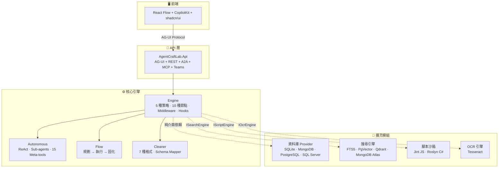

# AgentCraftLab

[English](README.md) | [繁體中文](README.zh-TW.md) | [日本語](README.ja.md)

[](https://timothysu2015.github.io/agent-craft-lab/)
[](LICENSE)
[](https://dotnet.microsoft.com/)

基於 .NET 打造的開源 AI Agent 平台 — 在 .NET 生態系中完成 Agent 工作流程的設計、測試與部署。


## 為什麼選擇 AgentCraftLab？

如果你的團隊使用 .NET，又想要 AI Agent 的能力 — 選擇非常有限。大多數 Agent 平台需要 Python、Node.js 或依賴大量 Docker 的技術堆疊。AgentCraftLab 是**原生 .NET**，使用 **SQLite 且零外部依賴**，可部署在任何 .NET 能執行的環境。

| | AgentCraftLab | Flowise | Dify | n8n |
|---|:---:|:---:|:---:|:---:|
| .NET native | O | X | X | X |
| Docker 一鍵啟動 | O | O | O | O |
| No Docker required | O | X | X | X |
| Visual workflow editor | O | O | O | O |
| MCP + A2A protocols | O | Partial | Partial | X |
| Teams Bot built-in | O | X | X | X |
| Local-first (SQLite) | O | X | X | X |
| Open source | O | O | Partial | O |

## 功能特色

**視覺化工作流程編輯器** — React Flow 拖放編輯器，支援 10+ 種節點類型：Agent、Condition、Loop、Parallel、Iteration、Human-in-the-Loop、HTTP Request、Code Transform、A2A Agent 及 Autonomous Agent。

**20+ 內建工具** — 網頁搜尋、電子郵件、檔案操作、資料庫查詢、程式碼探索等。可透過 MCP 伺服器、A2A Agent 或自訂 HTTP API 擴充。

**AI 建構模式** — 用自然語言描述你的需求，AI 自動為你生成工作流程。

**多協定部署** — 將工作流程發布為 A2A 端點、MCP 伺服器、REST API 或 Teams Bot — 全部在同一個平台完成。

**自主 Agent** — 給 AI 一個目標，讓它自行完成。ReAct 迴圈搭配子 Agent 協作、工具呼叫、風險審批及跨 Session 記憶。

**Flow 模式** — AI 規劃結構化的節點序列、執行後將結果固化為可重用的工作流程。連接探索與正式環境的橋樑。

**內建搜尋引擎 (CraftSearch)** — 全文 + 向量 + RRF 混合排序。5 種 Provider：SQLite FTS5、PgVector、Qdrant、MongoDB Atlas、InMemory。支援按知識庫路由搜尋引擎 — 不同的知識庫可使用不同的搜尋後端。支援 PDF、DOCX、PPTX、HTML 擷取。

**RAG 管線** — 上傳文件，自動擷取與分塊、嵌入向量並搜尋。支援臨時上傳或持久化知識庫。

**Doc Refinery** — 上傳文件，透過 LLM + Schema Mapper 清洗並擷取結構化資料。雙模式：快速（單次 LLM）或精準（多層 Agent + LLM Challenge 驗證）。

**Workflow 變數系統** — 三層變數架構：`{{sys:}}` 系統變數、`{{var:}}` 使用者定義變數、`{{env:}}` 環境變數。在設定中定義，任何節點中引用，輸入 `{{` 自動補全。

**Middleware 管線** — GuardRails、PII 遮蔽、速率限制、重試、日誌 — 全部以可組合的 `DelegatingChatClient` 裝飾器實現。

## 快速開始

### 方式 A：Docker（推薦）

```bash
git clone https://github.com/TimothySu2015/agent-craft-lab.git
cd agent-craft-lab
cp .env.example .env
# 編輯 .env 加入你的 LLM API Key（如 OPENAI_API_KEY）
docker compose up --build
```

在瀏覽器開啟 `http://localhost:3000`。

### 方式 B：本地開發

**前置需求：** [.NET 10 SDK](https://dotnet.microsoft.com/download/dotnet/10.0) + [Node.js 20+](https://nodejs.org/)

```bash
git clone https://github.com/TimothySu2015/agent-craft-lab.git
cd agent-craft-lab/AgentCraftLab.Web
npm install
npm run dev:all
```

在瀏覽器開啟 `http://localhost:5173`。

### 設定 LLM 憑證

在 **Settings → Credentials** 新增你的 LLM 提供者（Azure OpenAI、OpenAI、Anthropic、Ollama 等）。

**憑證模式** — AgentCraftLab 支援兩種憑證儲存模式：

| 模式 | 設定 | 說明 |
|------|------|------|
| `database`（預設） | `Credential:Mode=database` | API Key 加密存入資料庫（ASP.NET Data Protection）。適用自建平台。 |
| `browser` | `Credential:Mode=browser` | API Key 僅存於瀏覽器 `sessionStorage`，關閉分頁即清除。適用公開 Demo。 |

可透過 `appsettings.json`、環境變數 `Credential__Mode`、或 Docker `CREDENTIAL_MODE` 設定。

### 4. 建立第一個工作流程

1. 在側邊欄開啟 **Studio**
2. 將 **Agent** 節點拖放到畫布上
3. 設定系統提示詞並指派工具
4. 切換到 **Execute** 分頁，輸入你的訊息

或使用 **AI Build** — 在聊天面板中輸入描述，讓 AI 為你生成工作流程。

## 架構



### 專案結構

```
AgentCraftLab.sln
├── AgentCraftLab.Api/                              ← .NET API（AG-UI + REST，Minimal API）
├── AgentCraftLab.Web/                              ← React 前端（React Flow + CopilotKit + shadcn/ui）
├── AgentCraftLab.Engine/                           ← 核心執行引擎（無資料庫依賴）
├── AgentCraftLab.Autonomous/                       ← ReAct Agent（子 Agent、工具、安全機制）
├── AgentCraftLab.Autonomous.Flow/                  ← Flow 模式（規劃 → 執行 → 固化）
├── AgentCraftLab.Cleaner/                          ← 資料清洗引擎（7 種格式 + Schema Mapper）
├── extensions/
│   ├── data/
│   │   ├── AgentCraftLab.Data/                     ← 資料層抽象（15 個 Store 介面）
│   │   ├── AgentCraftLab.Data.Sqlite/              ← SQLite Provider（預設，零設定）
│   │   ├── AgentCraftLab.Data.MongoDB/             ← MongoDB Provider（可選）
│   │   ├── AgentCraftLab.Data.PostgreSQL/          ← PostgreSQL Provider（可選）
│   │   └── AgentCraftLab.Data.SqlServer/           ← SQL Server Provider（可選）
│   ├── search/AgentCraftLab.Search/                ← 搜尋引擎（FTS5 + PgVector + Qdrant + RRF）
│   ├── script/AgentCraftLab.Script/                ← 腳本沙箱（Jint JS + Roslyn C#）
│   └── ocr/AgentCraftLab.Ocr/                      ← OCR 引擎（Tesseract）
└── AgentCraftLab.Tests/                            ← 單元測試（1316）
```

### Engine — 作為函式庫使用

AgentCraftLab.Engine 可獨立使用，無需 Web UI：

```csharp
builder.Services.AddAgentCraftEngine();
builder.Services.AddSqliteDataProvider("Data/agentcraftlab.db");

// ...

var engine = serviceProvider.GetRequiredService<WorkflowExecutionService>();
await foreach (var evt in engine.ExecuteAsync(request))
{
    Console.WriteLine($"[{evt.Type}] {evt.Text}");
}
```

### 工作流程執行策略

引擎會自動偵測並選擇適當的執行策略：

| 策略 | 適用情境 |
|------|---------|
| **Single Agent** | 單一 Agent，無分支 |
| **Sequential** | 多個 Agent 依序串接 |
| **Concurrent** | 所有 Agent 同時執行 |
| **Handoff** | Router Agent 委派給專家 Agent |
| **Imperative** | 圖形遍歷，包含條件、迴圈、平行分支 |

### 節點類型

| 節點 | 說明 | LLM 成本 |
|------|------|---------|
| `agent` | 搭配工具的 LLM Agent | 有 |
| `code` | 確定性轉換（模板、正規表達式、json-path 等） | 零 |
| `condition` | 基於內容的分支判斷（包含/正規表達式） | 零 |
| `iteration` | 對列表進行 foreach 迴圈 | 每項目 |
| `parallel` | Fan-out/Fan-in 並行執行 | 每分支 |
| `loop` | 重複直到條件滿足 | 每迭代 |
| `human` | 暫停等待使用者輸入/核准 | 零 |
| `http-request` | 直接 HTTP API 呼叫 | 零 |
| `a2a-agent` | 呼叫遠端 A2A Agent | 零（遠端） |
| `autonomous` | 搭配子 Agent 的 ReAct 迴圈 | 有 |

### 部署協定

可將任何工作流程發布為：

| 協定 | 端點 | 使用情境 |
|------|------|---------|
| **A2A** | `POST /a2a/{key}` | Agent 對 Agent 通訊 |
| **MCP** | `POST /mcp/{key}` | Claude、ChatGPT 工具整合 |
| **REST API** | `POST /api/{key}` | 任何 HTTP 客戶端 |
| **Teams Bot** | `POST /teams/{key}/api/messages` | Microsoft Teams |

所有端點皆透過 API Key 認證保護。

## 資料庫

AgentCraftLab 預設使用 **SQLite** — 零設定，無需外部資料庫。只需一行設定即可切換至企業級資料庫：

| Provider | 設定值 | 使用情境 |
|----------|-------|---------|
| **SQLite** | `sqlite`（預設） | 本機開發、單人使用 |
| **MongoDB** | `mongodb` | 文件資料庫、雲端原生 |
| **PostgreSQL** | `postgresql` | 企業級關聯式資料庫 |
| **SQL Server** | `sqlserver` | .NET 企業應用、Azure SQL |

```json
{
  "Database": {
    "Provider": "postgresql",
    "ConnectionString": "Host=localhost;Database=agentcraftlab;..."
  }
}
```

每個知識庫可使用不同的搜尋後端（SQLite FTS5、PgVector、Qdrant 或 MongoDB Atlas）— 透過 Data Source 綁定按知識庫設定。

## 技術堆疊

- [.NET 10](https://dotnet.microsoft.com/) — API 後端 + 執行引擎
- [React](https://react.dev/) + [React Flow](https://reactflow.dev/) — 視覺化工作流程編輯器
- [CopilotKit](https://www.copilotkit.ai/) — AG-UI 協定 + 聊天介面
- [Microsoft.Agents.AI](https://github.com/microsoft/agent-framework) (1.0 GA) — Agent 編排框架
- [SQLite](https://sqlite.org/) / [PostgreSQL](https://www.postgresql.org/) / [MongoDB](https://www.mongodb.com/) / [SQL Server](https://www.microsoft.com/sql-server) — 可插拔式資料庫 Provider

## 貢獻

歡迎貢獻！請先開一個 Issue 討論你想要的變更。

## 授權

Copyright 2026 AgentCraftLab

依 Apache License, Version 2.0 授權。詳情請參閱 [LICENSE](LICENSE)。
